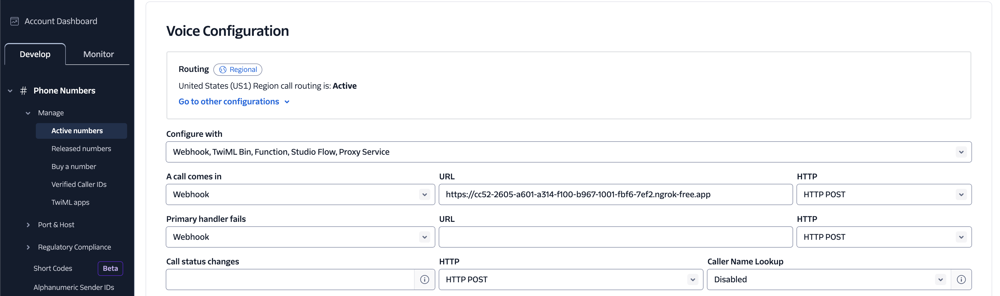

# Python Implementation for Handling Twilio Phone Calls

This package handles all the audio conversion so that you can just deal with text-to-text.

## Usage

This is the gist (see [`example/fastapi.py`](example/fastapi.py) for the full example).

```python
from twilio_phone_calls import (
    create_twilio_voice_response,
    TwilioPhoneCall,
)
from twilio_phone_calls.twilio_pydantic import StreamEventsEnum


...


# Your custom text-to-text function.
def parrot(caller_message: str) -> str:
    agent_response = f"You said: \"{caller_message}\""
    return agent_response


"""
FastAPI methods but could use a different server.
"""

@app.post("/")
async def phone_call(request: Request):
    form_data = await request.form()
    voice_response = create_twilio_voice_response(
        caller_number=form_data.get("Caller"),
        """
        To get one of these, go to: https://dashboard.ngrok.com/
        Make a free account - it takes 2 seconds.
        """
        websocket_url="wss://4a95-2605-a601-a314-f100-b967-1001-fbf6-7ef2.ngrok-free.app/stream",
    )
    response = Response(
        content=voice_response.to_xml(),
        media_type="application/xml",
    )
    return response

@app.websocket("/stream")
async def stream(websocket: WebSocket):

    ...

    stream: TwilioPhoneCall | None = None

    ...

    while True:
        twilio_json = await websocket.receive_text()
        twilio_message: dict = json.loads(twilio_json)

        ...

        if stream is None:
            # Call created.
            stream = TwilioPhoneCall.from_start_message(
                twilio_message,
                send_websocket_message_async_method=websocket.send_text,
                text_to_text_async_method=parrot,
            )
            await stream.send_text_as_audio("Hey! How can I help you?")

        else:
            """
            Voice samples are split across (very) many twilio messages.
            Once a full sample has been pieced together
            and a long pause detected, the voice message will be processed
            and a response (i.e. `mail`) provided.
            """
            stream.receive_twilio_message(twilio_message)

...
```

## Deployment

Here's an example of where to put an ngrok URL in the Twilio dashboard.


